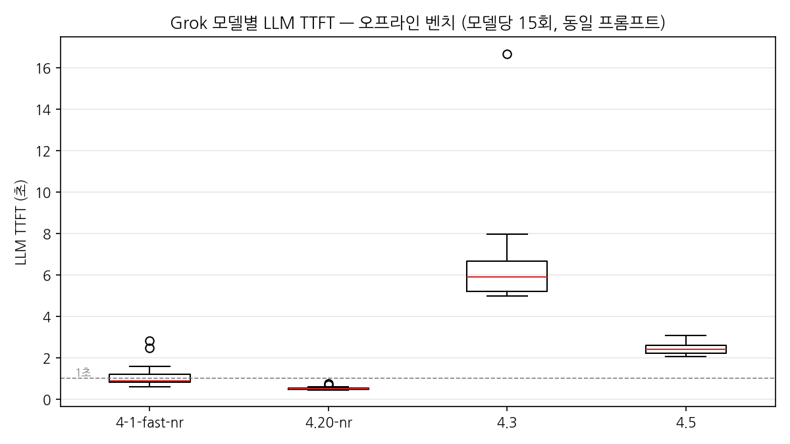
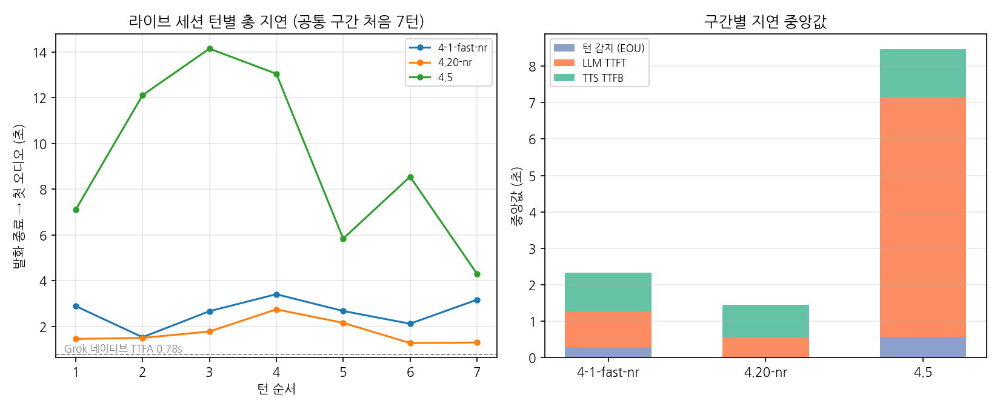

# Phase A 캐스케이드 — Grok LLM 모델 평가 (2026-07-21)

대담의 Phase A 캐스케이드 파이프라인(Grok STT → LLM → TTS, Silero VAD)에서 어떤 Grok 모델을
기본 LLM으로 쓸지 정하기 위해, 오프라인 벤치마크와 실전형 라이브 면접 세션으로 후보를 평가했다.
캐스케이드를 먼저 운용하는 목적이 "네이티브 음성 모델(Phase B)로 넘어가기 전에 지연과 한계를
온전히 체감·기록하는 것"이므로, 수치와 함께 정성 관찰을 남긴다.

## 1. 평가 방법

**오프라인 벤치 (지연 신뢰성 측정)** — `scripts/bench_llm_ttft.py`
- 모델당 워밍업 1회(제외) + 본측정 15회, 라운드로빈 인터리빙으로 시간대 편향 분산
- keep-alive 연결 재사용(워커의 지속 연결과 동일 조건), 동일한 한국어 면접 프롬프트
- TTFT = 첫 "본문" 토큰까지의 시간. reasoning 모델의 사고 토큰은 음성으로 나갈 수 없으므로 제외

**라이브 세션 (품질 평가)** — 상위 3종만
- 동일 조건: 면접관 instruction v1, 동일 시나리오(백엔드 3년차·결제 시스템·장애 대응),
  동일 자기소개 스크립트, 헤드셋, 조용한 실내, 세션당 7~16턴
- 7항목 루브릭: 존댓말 / 첫 발화 안내 / 질문 1개·3문장 / 꼬리질문 적절성 / 반복 횟수 / 자연스러움 / 자유 메모
- 턴별 구간 지연(턴 감지 EOU / LLM TTFT / TTS TTFB)을 코드 계측으로 JSONL 기록

**한계** — 라이브는 모델당 1세션(n=1)이므로 품질 판단은 벤치 수치로 교차 확인했다.
실전에서는 리서치 요약·지원서가 컨텍스트에 추가되어 프리필이 커지므로 TTFT 절대값은
여기 수치보다 올라갈 수 있다(모델 간 상대 비교는 유효).

## 2. 정량 결과

### 오프라인 벤치 — LLM TTFT (초)

| 모델 | n | 평균 | 중앙값 | p95 | 최소~최대 |
|---|---|---|---|---|---|
| grok-4-1-fast-non-reasoning | 15 | 1.18 | 0.90 | 2.48 | 0.59~2.84 |
| **grok-4.20-0309-non-reasoning** | 15 | **0.54** | **0.52** | **0.68** | 0.45~0.76 |
| grok-4.3 | 14 | 6.74 | 5.89 | 7.97 | 4.98~16.68 |
| grok-4.5 | 15 | 2.44 | 2.42 | 2.76 | 2.05~3.07 |

reasoning 계열(4.3, 4.5)은 사고 토큰 생성 때문에 첫 본문 토큰까지 2.4초 이상 —
실시간 음성 대화 기준선(1초 내외)을 크게 벗어난다. 라이브 후보는 non-reasoning 2종에
품질 대조군으로 grok-4.5를 더해 3종으로 압축했다.

### 라이브 세션 — 발화 종료 → 첫 오디오 (초)

| 모델 | 실턴 | total 중앙값 | 범위 | TTFT 중앙값 | 특이 |
|---|---|---|---|---|---|
| grok-4-1-fast-non-reasoning | 16 | 2.67 | 1.53~4.65 | 0.99 | TTFT 스파이크(1.5~2.3s) 4회, EOU 2.5s 캡 2회 |
| **grok-4.20-0309-non-reasoning** | 9 | **1.50** | 1.27~2.75 | **0.56** | 스파이크 1회뿐, 가장 안정 |
| grok-4.5 | 7 | 8.55 | 4.31~14.14 | 6.58 | 컨텍스트가 쌓일수록 악화(중반 12~14s) |

- 벤치의 모델 간 순위·격차가 라이브에서 그대로 재현됐다 (벤치 신뢰성 확인)
- 참고 기준선: Grok 네이티브 음성(Phase B 후보) TTFA ~0.78s. 현재 캐스케이드 최선(1.50s)과도
  약 2배 차이 — 구간 분해상 남는 병목은 TTS TTFB(~0.9s)와 턴 감지다
- 구간별 차트의 EOU 중앙값은 "전사 지연이 턴 커밋보다 늦게 끝난 턴"(EOU=0으로 기록)을
  포함하므로 실제 대기 체감보다 낮게 보일 수 있다

## 3. 정성 결과 (7항목 루브릭)

| 항목 | 4-1-fast-nr | 4.20-nr | 4.5 |
|---|---|---|---|
| 존댓말 | O | O | O |
| 첫 발화 안내 | O | O | O |
| 질문 1개·3문장 | 준수 | 준수 | 준수 |
| 꼬리질문 | 꽤 날카로움 | 적절 | 적절 |
| 반복 | 1~2회 | 1회* | 없음 |
| 자연스러움 | 대체로 자연스러움 | 자연스러움 | 자연스러움 |

\* STT가 사용자 발화를 일본어로 오전사하자 "답변이 명확하지 않다"며 재질문한 것 —
깨진 입력에 대한 합리적 대처로 모델 결함이 아님.

**주목할 대비** — 동일한 STT 일본어 오염 상황에서 4.20-nr은 재질문했고, grok-4.5는
reasoning 성능으로 깨진 전사를 문맥 복원해 그대로 알아듣고 대답했다. 품질 최상위는
분명 4.5지만, 턴당 8~14초 침묵은 면접 대화가 성립하지 않는 수준이었다.

이전에 4.20-nr에서 관찰됐던 반말·지시 이탈·동어 반복은 임시 2줄 프롬프트에서의 현상이었고,
instruction v1에서는 전혀 재현되지 않았다. 모델 품질 평가는 실전 프롬프트 위에서 해야 한다는
교훈도 함께 남긴다.

## 4. 캐스케이드 한계 관찰 (모델 무관 — Phase B 검증 포인트)

세 세션에서 공통으로, LLM 선택과 무관하게 재현된 문제들:

1. **STT 한영 혼용 취약** — "Spring Boot" 같은 영어 단어가 섞이는 순간 언어 감지가 en으로
   틀어지고, 이후 순수 한국어 문장까지 오전사로 오염된다. 기술 면접은 영어 용어 혼용이
   필수적이라 비중 있는 결함
2. **STT 일본어 혼입·환각** — 한국어 발화가 "プロ", "はい、伊勢に"로 전사되거나, 정적 구간에서
   "I don't need" 같은 없는 말이 생성됨. `language="ko"`를 지정해도 감지 언어가 널뛰는 것으로
   보아 이 파라미터는 강제가 아닌 힌트로 동작
3. **긴 독백의 턴 조각남** — 1분 자기소개처럼 문장 중간 침묵이 있는 숙고형 발화에서 완결형
   문장마다 턴이 커밋되어 면접관이 중간에 끼어든다. 전사가 "왜냐하면"/"그리고" 단위로 조각남
4. **턴 감지 천장** — 발화 종료 확신이 낮으면 EOU가 2.5초 캡까지 대기 (세션 1에서 2회)
5. **모델 자율 종료 위험** — 지원자의 "감사합니다"를 종료 신호로 오해하고 면접을 조기 종료한
   사례 발생. instruction 보강으로 완화했으나, 근본적으로 면접 진행·종료 판단을 모델에 맡기면
   안 된다는 실증 → 서버가 질문 풀·시간을 강제하는 설계(아키텍처 원칙)의 근거
6. **세션당 첫 호출 콜드 스타트** — 인사 턴 TTFT 2.3~4.6s로 이후 턴 대비 3~6배

## 5. 결론

- **Phase A 기본 모델: `grok-4.20-0309-non-reasoning` 채택 권고.** 라이브 품질 전 항목 준수,
  TTFT 중앙값 0.52s(차순위의 절반)에 p95 0.68s로 분산까지 가장 안정적
- grok-4.5는 품질(오염 입력 강건성) 최상위지만 지연이 실격 수준 — 답변별 평가 리포트 생성 등
  비실시간 경로에 활용 후보
- 캐스케이드 총 지연 중앙값 1.50s vs 네이티브 TTFA 0.78s: 남는 병목이 LLM이 아닌
  TTS TTFB·턴 감지로 이동했다. 위 한계 관찰 6건과 함께 Phase B 전환 시 비교 검증할 체크리스트로 사용
